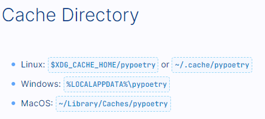

<h1 align="center">
  <b>Robust Agile Detector (RAD_ECG) </b><br>
</h1>

<p align="center">
      <a href="https://www.python.org/">
        </a>
      <a href="https://numpy.org/doc/">
        </a>
      <a href="https://pandas.pydata.org/docs/index.html">
        </a>
      <a href="https://rich.readthedocs.io/en/stable/">
        </a>
      <a href="https://wfdb.readthedocs.io/en/latest/">              
        </a>
      <a href="https://docs.scipy.org/doc/scipy/">            
        </a>
      <a href="https://matplotlib.org/stable/index.html">            
        </a>
      <a href="https://cloud.google.com/storage/docs">            
        </a>
</p>


## Requirements

- python = "^3.11"
- numpy = "^1.25.0"
- pandas = "^1.5.0"
- rich = "^13.8.0"
- wfdb = "^4.1.2"
- scipy = "^1.14.0"
- matplotlib = "^3.9.0"
- google-cloud-storage = "^2.18.2"

# Cloning the repo

Launch VSCode if that is IDE of choice.
`CTRL + ~` will open a new terminal
Navigate in your terminal to where you want the repo cloned and follow the below commmands to generate the necessary file directory structure.

```terminal
git clone https://github.com/METIS-MICOR/rad_ecg.git
cd rad_ecg
mkdir src/rad_ecg/data/inputdata src/rad_ecg/data/logs src/rad_ecg/data/output src/rad_ecg/secret
```


# Project setup with Poetry


## How to check Poetry installation

In your terminal, navigate to your root folder.

If poetry is not installed, do so in order to continue
This will install version 1.7.0.  Adjust to your preference

```terminal
curl -sSL https://install.python-poetry.org | python3 - --version 1.7.0
```

To check if poetry is installed on your system. Type the following into your terminal

```terminal
poetry -V
```

if you see a `version` returned, you have Poetry installed.  The second command is to update poetry if its installed. (Always a good idea). If not, follow this [link](https://python-poetry.org/docs/) and follow installation commands for your systems requirements. If on windows, we recommend the `powershell` option for easiest installation. Using pip to install poetry will lead to problems down the road and we do not recommend that option.  It needs to be installed separately from your standard python installation to manage your many python installations.  `Note: Python 2.7 is not supported`

## Environment storage

Some prefer Poetry's default storage method of storing environments in one location on your system.  The default storage are nested under the `{cache_dir}/virtualenvs`.  See the below image for general system location of the cache.



If you want to store you virtual environment locally.  Set this global configuration flag below once poetry is installed.  This will now search for whatever environments you have in the root folder before trying any global versions of the environment in the cache.

```terminal
poetry config virtualenvs.in-project true
```

For general instruction as to poetry's functionality and commands, please see read through poetry's [cli documentation](https://python-poetry.org/docs/cli/)

To spawn a new poetry .venv

```terminal
poetry shell
```

To install libraries

```terminal
poetry install
```

This will read from the poetry lock file that is included
in this repo and install all necessary packagage versions.  Should other
versions be needed, the project TOML file will be utilized and packages updated according to your system requirements.  

To view the current libraries installed

```terminal
poetry show
```

To view only top level library requirements

```terminal
poetry show -T
```

## Runtime Notes

To run the extraction program, run the command

```terminal
poetry run python src/rad_ecg/scripts/peak_detect_v3.py
```

# Project setup *without* Poetry

First you would make your virtual environment and then activate it.

```terminal
python -m venv .venv

#activate the environment in your terminal 
#On Windows
.venv\Scripts\activate.bat

#On Mac
source .venv/bin/activate
```

Before next step, ensure you see the environment name to the left of your command prompt.  If you see it and the path file to your current directory, then the environment is activated.  If you don't activate it, and start installing things.  You'll install all the `requirements.txt` libraries into your base python environment. Which will lead to dependency problems down the road.  I promise.

Once activated, install the required libraries and run the script.

```terminal
pip install -r requirements.txt
python src/rad_ecg/scripts/peak_detect_v3.py
```

Before running the `peak_detect_v3.py` script, adjust the `config.json` in the root of the package to your runtime requirements.

|Field|Selection|Description|
|:----|:----|-----|
|"plot_fft"| false | Do you want to plot the fourier transforms when a signal is lost?|
|"plot_errors" | false | Do you want to plot errors as they occur in extraction|
|"live_term"|false|Do you want to display the terminal dashboard during extraction|
|"porcine"|false| Is this porcine data?  |
|"samp_freq|170| What sampling frequency was used with the data (Hz)|
|"data_path" |"/src/rad_ecg/data/inputdata/"|Path of where to find your data|
|"save_path" |"/src/rad_ecg/data/output/"|Path of where export the results|
|"gcp_bucket" |false|Whether or not to look in a GCP bucket|
|"bucket_name" |bucketname|Name of the GCP Bucket|
|"cam" |""|Name of CAM Analyzed.  (generated post analysis)|
|"last_run" |datetime|Time of last script run  (generated post analysis)|

## Note to users

This repo is under active development, so if something is malfunctioning.  Please open an issue and I'd be happy to address it. 

## Todo List

### Short term
- peak_detect_v3.py
  - [ ] Extension for S&P
    - Build the ability to submit a template avg to extract relevant metrics.  
    - Build in new py file
  - [x] Review T onset extraction
  - [ ] Add J point discovery (Means I'll need a base container change as well)
    - Use same logic as Q onset.
  - [x] Change base container to dataclass. Might not do this actually.  Class objects aren't as lean as dictionary's
  - [ ] Add overall progbar with standard log output
  - [ ] In Tui, track / display runtime metrics.  (Section rejections, top 2 errors, AvgHR, RMSSD)

- slider.py
  - [ ] Add stumpy wave search for anomaly detection
  - [ ] Incorporate FFT analysis for slider.py at any point in an ECG.
  - [ ] Re-examine distribution threshold of QRS window.
  - [ ] Split out configs for slider.py.  Cumbersome switching files so have it only look for local CAMS and display the file tree (like hem shock tui)

### Long Term
- peak_detect.py
  - [ ] Apply inverse logic for analyzing porcine data
  - [ ] Anomaly Detection
  - [ ] Arrthymia Detection
  - [ ] Batch Processing - Some or all

- package
  - [ ] Add instructions for complete package installation
